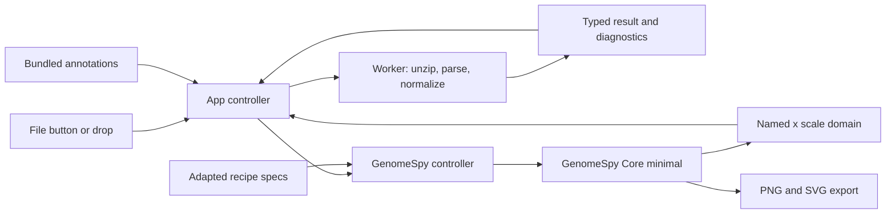

# Wakhan Explorer implementation plan

Status: proposed; source inspection completed on 2026-09-29. This document plans
the application. No application scaffold or dev server has been implemented yet.

Recommended approach: keep one GenomeSpy instance for compatible results, parse
ZIPs in a Worker, and replace named datasets while restoring the current locus.
Reuse the recipe's visual design, with explicit adapters for current Wakhan tables.
Keep the importer simple: use explicit metadata and documented table conversions,
report missing information, and request additions from the Wakhan authors. The
current ZIPs can support exploration with separate CN and depth tracks. Normal
calibrated overlays require calibration exported by Wakhan; an optional development
experiment may estimate it from gene tables to help adapt and inspect the recipe.

Contents: [scope](#1-product-and-scope), [inspection findings](#2-what-the-inspection-established),
[user experience](#3-user-experience), [architecture](#4-architecture),
[GenomeSpy and replacement](#5-genomespy-integration-and-result-replacement),
[mode coverage](#6-wakhan-mode-coverage), [ZIP shortcomings](#7-zip-shortcomings-and-upstream-requests),
[data and export](#8-annotations-export-and-delivery),
[milestones](#9-initial-implementation-milestones), [evidence](#10-evidence-and-references).

## 1. Product and scope

Build a small, entirely browser-side application: **open a Wakhan ZIP and explore
it immediately**. Use the existing HCC1954 recipe's GenomeSpy design, with a Lit
shell for opening files, switching between results, navigation, and export.

### Goals

- One ZIP, opened through a button or drag and drop, is sufficient for the normal
  workflow. Detect its contents and assembly without an initial setup wizard.
- Preserve the recipe's linked navigator, SV arcs and breakpoint feet, haplotype
  tracks, BAF, masks, LOH, cytobands, cancer genes, rulers, and selections.
- Open another ZIP at any time and retain the current genomic x domain. Keep
  recently opened results in memory so switching between two files is immediate.
- Support phased integer and subclonal results first, then the other Wakhan
  layouts when their source data are present. Report missing information honestly.
- Keep ZIP-derived rows outside the specification; supply them through named
  datasets and GenomeSpy's public runtime API.
- Export the current visualization as PNG or SVG.
- Use Vite, TypeScript, Lit web components, plain CSS, Vitest, and npm. Run first
  through Vite; keep the build suitable for GitHub Pages.
- Deliver clear, author-facing documentation of ZIP shortcomings and concrete
  additions that would resolve them. Update it as implementation reveals gaps.

### Implementation policy: KISS and report

The user works with the Wakhan authors, so missing essential information should
be fixed in the export contract. Prefer small, documented conversions of reported
data. Keep calibration reconstruction out of the normal importer, with the bounded
development experiment below as an explicit exception. Do not guess the selected
solution, reverse-engineer other missing scientific metadata, or build a growing
collection of speculative compatibility paths. If information is unavailable, use a simple
honest display, omit the affected feature, or explain why the file cannot be
interpreted. Record the gap, its effect, and the precise upstream addition needed.

### Non-goals for the initial application

- Running Wakhan, calling or editing CN/SVs, fitting purity/ploidy, changing phase
  assignments, or estimating subclonal cell fractions.
- Reproducing every Plotly diagnostic, its mirrored coordinate layout, or its
  HTML. Phase-correction history, per-SNP pileups, and optimization grids are not
  in these ZIPs.
- Importing the old Zenodo tarball/Plotly HTML or raw BAM/CRAM files in the browser.
- A backend, accounts, uploads to a server, persistent sample storage, cohort
  analysis, simultaneous comparison panels, or a general genome-browser builder.
- Liftover between assemblies, automatic parental assignment of HP1/HP2, or
  treating caller confidence as phasing confidence.
- Recovering missing metadata through regression, heuristics, or sample-specific
  constants in the normal importer. The development calibration experiment is
  allowed, while explicit calibration remains an upstream format request.
- Deploying to GitHub Pages during the first implementation milestone.

## 2. What the inspection established

### Existing applications and design

**SegmentModel Spy** demonstrates the right scale of application: a small Vite
page, local file opening, GenomeSpy embedding, and reference annotations. Its
current flow collects several files, selects an assembly, embeds data in
`data.values`, and finalizes/recreates the visualization. Reuse its approachable
interaction model; the ZIP importer and persistent viewport need their own
implementation. Use Lit components rather than its module-level `lit-html` state.

**The HCC1954 recipe** is the visual reference. Its ten JSON specs already define
the coordinated views and interactions. Keep their track decomposition and
visual encodings, composing imported JSON objects in TypeScript so Vite owns the
assets. Replace sample-specific text, URL data sources, fixed loci, and calibration
constants. Static guide rows such as `values: [{}]` can remain in the spec.

The recipe extracts independent HP BED files and literal arrays from an archived
Plotly figure. The new ZIPs provide merged HP tables and native coverage/BAF files;
port the relevant normalization and SV semantics, not the archive/HTML extractor.

### The two supplied ZIPs

Counts below are source rows before normalization/filtering; CN rows contain both
haplotypes. Both archives have eight flat members and cover chr1–22 and chrX in
their coverage and CN tables. Their VCF dictionaries also contain chrY.

| Property | HCC1937 | HCC1954 |
| --- | ---: | ---: |
| ZIP bytes | 1,319,889 | 1,470,008 |
| Total uncompressed bytes | 5,591,766 | 6,114,508 |
| Integer profile rows | 461 | 1,271 |
| Subclonal profile rows | 461 | 1,271 |
| Coverage bins | 60,630 | 60,630 |
| BAF bins | 60,630 | 60,630 |
| Gene result rows | 85 | 85 |
| VCF records | 1,018 | 1,926 |
| Ranking entries | 3 | 2 |

| Member | Observed contract | Application use |
| --- | --- | --- |
| `integer_profile.bed` | Comment preamble, then `#chr` tabular header; HP1/HP2 coverage, state, confidence, union of SV IDs | Integer CN rules and tooltips |
| `subclonal_profile.bed` | Same, plus `hp1_is_subclonal` and `hp2_is_subclonal`; fractional states | Profile toggle and caller subclonal flags |
| `phase_corrected_coverage.csv` | **Tab-delimited**, headerless: chromosome, start, end, HP1, HP2, unphased | Raw depth dots; third series is all zero in both supplied ZIPs |
| `baf.csv` | Comma-delimited, headerless: chromosome, bin start, folded BAF | BAF track, joined to coverage intervals by chromosome and source start |
| `genes_copynumber_states.bed` | Commented header; actual/adjusted HP depth and integer gene states | Caller gene details; optional development calibration experiment |
| `grch38.cen_coord.curated.bed` | Headerless three-column TSV | Wakhan source masks; filename can vary |
| `severus_somatic.vcf` | Severus v1.8; one sample, `wakhan_haplotagged`; contig lengths and phased SV fields | Assembly dictionary, SVs and support |
| `solutions_ranks.tsv` | Ordinary header; repository name, DNA/cell purity, ploidy, confidence, rank | Run-level ranking information |

Neither ZIP contains LOH intervals, a manifest, a Wakhan version, explicit
coverage-to-CN calibration, or the identity of the enclosed solution. The archive
filename is a useful display label but is not authoritative sample metadata.

### Important differences from the proof of concept

1. **One solution per ZIP.** `compressed_output.py` writes the same
   `HiScanner_plots_data.zip` basename inside each solution directory, flattens
   its members, and includes the entire run's ranking table. Do not assign rank 1
   to the open data or offer a solution selector backed only by ranking rows.
   Show rankings in a details panel with “included solution not identified”. A
   future manifest can make this association explicit.
2. **Masks are field-specific.** Each subclonal table has 23 masked rows with
   coverage and CN equal to 3300; corresponding integer rows are zero placeholders.
   Raw coverage contains no 3300 sentinel in these ZIPs. The centromere file and
   segment evidence must drive masks; copying the recipe's coverage-only mask
   detection would miss them.
3. **BAF 3300 means unavailable.** It occurs in 14,942 HCC1937 and 11,866 HCC1954
   bins. Current Wakhan uses it for bins with insufficient SNP support. This does
   not make the same interval a CN mask. Retain ordinary BAF zero values and do
   not invent SNP counts; the archives do not record them.
4. **High CN is real source data.** HCC1954 has integer states up to HP1=307 and
   HP2=311 around chr17:39.8 Mb, with segment depth above 5,000. Avoid arbitrary
   “large value” filters and the recipe's old CN-33 example assumption.
5. **Coordinates need a Wakhan adapter.** Bins start at 0, then 50001, 100001,
   etc.; every adjacent segment pair in these files has `next.start = end + 1`.
   A `.bed` extension alone does not establish half-open coordinates.
6. **ZIP production does not cover every mode.** The inspected exporter requires
   SVs, BAF, genes, both CN profiles, and rankings. It is called in the phased
   solution branch. Unphased output uses a different single-track BED schema
   and is not zipped by that branch. These are upstream packaging limitations,
   not reasons to fabricate absent tracks.

## 3. User experience

### Welcome

Use a quiet page headed “Wakhan Explorer”, a one-sentence explanation, a large
drop area, and **Open ZIP**. Explain that files are processed in the browser.
Include a GenomeSpy link and brief navigation help. Start exploration automatically
after parsing; there is no separate “Visualize” step. A keyboard-accessible native
file input backs the button. ZIPs remain local even though the page itself is
served over HTTP.

### Exploring

```text
Wakhan Explorer   [Open ZIP] [Open results ▾]        [PNG] [SVG]  GenomeSpy
File / assembly   [Integer | Subclonal] [Locus or gene…] [Whole genome]
──────────────────── whole-genome navigator ──────────────────────────
Structural variants: colored domes, feet, insertions, single breakends
HP1: copy number and calibrated depth
HP2: copy number and calibrated depth
Folded BAF
LOH, when available
Cytobands
Cancer genes
──────────────── [Show ruler] [Data details] [Help] ───────────────────
```

The normal calibrated layout requires exported calibration. For the supplied ZIPs,
default to separate aligned CN and raw-depth subtracks and explain that calibration
is missing. The optional development estimate can preview the calibrated layout.

Keep the recipe's red/blue haplotype colors, muted depth dots, SV class colors,
publication-ranked gene labels, hatched masks, and subdued missing-CN regions.
Keep navigator brushing, continuous zoom/pan, Shift-drag interval selection,
SV hover/click highlighting, and linked rulers. Replace the hard-coded HCC1954
locus buttons with a chromosome/locus input and gene lookup over bundled genes.

**Open ZIP** and a page-wide file-drop target remain available during exploration.
Keep the active and previous result in memory initially; opening a third can evict
the older inactive result. A two-entry result switcher supports A/B comparison
without repeated parsing. The viewport belongs to the workspace: switching files
uses the locus currently on screen, not a separate saved locus for each file.

Show loading stages (“Reading ZIP”, “Parsing”, “Preparing tracks”), errors, and
export status in an accessible live region. An invalid replacement leaves the
current view and locus usable. Cancel a superseded parse; the most recently opened
file wins. Native buttons, visible focus, labels, and text feedback accompany
drag/drop. Ignore non-file drags so they cannot interfere with GenomeSpy gestures.

Data details expose available/missing tracks, normalization diagnostics, VCF sample,
ranking ambiguity, and whether calibration was supplied. Do not put parser internals in the
main flow. Keep HP labels described as chromosome-local and CN confidence clearly
distinguished from phasing confidence.

## 4. Architecture



### Small, explicit modules

```text
index.html
src/
  main.ts
  app/wakhanExplorer.ts          Lit shell and application state
  app/fileDropZone.ts            Shared file-open interaction
  app/explorerToolbar.ts         Result/profile switch, navigation, export
  styles.css                    Plain CSS, layout and design tokens
  import/importWorker.ts        ZIP orchestration and cancellation boundary
  import/archive.ts             Entry discovery and extraction limits
  import/parse*.ts               Typed Wakhan table and Severus adapters
  model/result.ts               Canonical result, capabilities, diagnostics
  model/normalize*.ts            Coordinates, masks, missingness, calibration
  visualization/createSpec.ts    Compose recipe tracks for available capabilities
  visualization/controller.ts   Embed lifecycle, named data, viewport, export
  visualization/specs/           Adapted recipe track specifications
  annotations.ts                Load pinned bundled annotations
data/                           Annotation TSVs, README, provenance.json
docs/wakhan-zip-format.md        Observed shortcomings and requests for Wakhan authors
scripts/estimateCalibration.ts   Optional development experiment, outside the importer
```

Keep tests next to their modules and small synthetic fixtures under
`test/fixtures/`. The two real ZIPs in ignored `tmp/` are local acceptance inputs,
not files copied into the deployed application.

Use a module Worker created with Vite's `new URL(..., import.meta.url)` pattern.
Pass the selected File to it; keep decompression and parsing off the UI thread.
Use `fflate` for ZIP handling and small explicit typed delimited-file adapters.
Reuse GenomeSpy's eager VCF reader in the Worker: its exported parser already wraps
`@gmod/vcf` and materializes sample fields as ordinary objects. Keep sample
selection, validation, SV pairing, and missingness policies in our adapter. Verify
the reader's exported module in the chosen npm release in the first build.

For these roughly 6 MB expanded archives, ordinary row objects are adequate.
Avoid introducing Arrow, Parquet, a state framework, or a generic plugin system.
Keep canonical cached results separate from the rows handed to GenomeSpy, whose
transforms may annotate records. Release archive bytes and temporary text after
normalization; release the Worker and embed when their owner is disposed.

### Archive and parser boundaries

- Recognize schemas from headers and column counts, rather than relying only on
  filenames. Find the tabular `#chr` header after comment descriptions.
- Prefer a versioned manifest once agreed with the authors. Keep support for the
  inspected manifest-free format in one explicit adapter; reject unknown schemas
  with a useful diagnostic rather than trying a succession of guesses.
- Accept flat ZIPs and a single enclosing folder. Reject ambiguous duplicate
  required members; do not silently choose between multiple solution folders.
- Require a recognizable CN profile. Coverage, BAF, SVs, LOH, gene results,
  masks, and rankings are independent capabilities; absent optional data does
  not prevent exploring CN. Distinguish missing data from a valid empty track.
- Check member count, compressed size, declared and actual expanded bytes, and
  supported compression. Extract only recognized files; do not execute HTML or
  scripts. Errors identify the member and line when possible.
- Validate finite values, field counts, interval order, duplicate keys, contigs,
  and expected coordinate ranges. Invalid optional tables get an explicit
  diagnostic and a disabled track; invalid primary CN data rejects the import.

### Canonical result

Represent `WakhanResult` as assembly/contigs, display metadata with provenance,
available profiles, capabilities, named tables, and diagnostics. Use nullable
numeric values with an explicit status (`reported`, `masked`, `unavailable`).
Keep original coordinates, identifiers, and caller values for tooltips/auditing.

| Named dataset | Canonical rows |
| --- | --- |
| `coverage` | chrom, start, end, HP1/HP2/unphased or total depth, per-series status |
| `segments` | chrom, start, end, haplotype or total, CN, median depth, confidence, subclonal flag, SV IDs |
| `baf` | chrom, start, end, folded BAF, status |
| `svLinks`, `svSites` | endpoints/sites, SV class, original type/IDs, strands, HP/phase sets, GT, support/VAF |
| `masks`, `unavailableCn` | intervals, scope/haplotype, reason |
| `loh` | intervals and reported HP when present; source-call semantics |
| `geneResults` | Caller-provided gene measurements and states |
| `genes`, `cytobands` | Bundled reference annotations |

Expand merged HP segment columns to long-form rows. Keep both normalized profiles
in the result; publish only the active profile into `segments`. Switching profiles
also updates profile-specific masks/missing intervals. Never treat a fractional
CN or an `is_subclonal` flag as a cellular fraction.

### Coordinate and assembly policy

Normalize supported current Wakhan coverage/CN intervals to zero-based half-open
coordinates using `start = max(0, sourceStart - 1)`, `end = sourceEnd`. This matches
the observed adjacent-boundary convention and the recipe's CN conversion. Test
first/last bins, single-base segments, and merged fragments explicitly; reject or
add a documented adapter for a differing convention rather than guessing per row.
Reference TSVs are already half-open. Normalize VCF anchors with `POS - 1` while
preserving original POS/END. Give LOH and gene-result files their own contracts;
do not apply the CN rule indiscriminately to every BED/CSV.

Join BAF to coverage by original chromosome/bin start, not row index. For unmatched
BAF rows, retain a point representation and report the lack of bin bounds; do not
invent a 50 kb bin. Sort using the assembly dictionary, not lexical BED row order.

Use VCF contig lengths to validate a recognized assembly; both supplied VCFs match
GRCh38. Normalize `1`/`chr1` aliases only through a checked mapping. Use a stable
complete reference dictionary for recognized assemblies even when a sample lacks
chrY, so genome-wide offsets stay comparable. Prefer assembly and contigs declared
in the ZIP manifest when available. If neither metadata nor a complete VCF dictionary
identifies the reference, offer a supported assembly choice or report that a
dictionary is required. Support a custom reference when its complete dictionary is
supplied, and omit incompatible annotations. Do not infer chromosome lengths from
coverage endpoints or CN segments. Report the lack of an independent assembly
declaration, especially for modes without a VCF.

### Masks, missingness, and calibration

Interpret the supplied centromere BED as Wakhan masking input (with its special
start=1 chromosome-start convention), not merely a cytoband decoration. Use the
matching segment boundaries and explicit sentinels to classify placeholders.
Carry mask scope through depth, CN, and LOH and exclude it from autoscaling. Keep
source rows for inspection. Preserve reported zeros outside masks, including the
fact that Wakhan's merged writer can zero-fill a missing haplotype; these are not
automatically evidence of a biological deletion.

Keep the current sentinel/mask conversion bounded to behavior established by the
inspected writer and files. Ambiguous rows remain explicitly uncertain. Request
per-row status and explicit mask scope from Wakhan instead of adding cross-table
inference rules to resolve every ambiguous zero.

BAF sentinels and invalid values are unavailable BAF, not zero and not global
masks. Keep valid zero values with unavailable SNP-support metadata. Missing CN
tails/chromosomes get the recipe's pale unavailable-region treatment. Keep the
reported unphased series available but hide it by default when it is entirely zero.

In the normal import path, use calibration only when exported explicitly for the
enclosed solution. Request
the mapping used by Wakhan's own plot: slope/intercept and units for
`depth = depthOffset + singleCopyDepth * CN`, or explicit CN/depth centers and a
documented mapping if that affine relation does not describe a mode. Its scope
must identify the applicable profile and depth series.

For the supplied ZIPs, display raw depth and CN in separate aligned subtracks.
Show “Depth calibration is not included in this ZIP” in data details. Do not reuse
the recipe's sample-specific calibration.
When valid explicit calibration becomes available, enable the recipe's CN-driven
shared y range and coupled right depth axis. Test presence, absence, and invalid
calibration; missing calibration must not block the other tracks.

#### Optional development experiment: estimated calibration

Try a small script that fits `adjustedDepth = offset + singleCopyDepth * CN`
using the gene table's `hp1_state`/`hp2_state` and corresponding
`adjusted_coverage_hp1`/`adjusted_coverage_hp2`. The inspected gene writer reports
snapped depth centers rounded to two decimals, making these useful candidate
calibration pairs. Do not fit raw gene depth or segment medians as additional
fallbacks. Keep the experiment separate from normal ZIP parsing.

A preliminary check on 2026-09-29 excluded genes overlapping a subclonal masked
segment for the relevant haplotype, deduplicated the remaining CN/depth pairs,
and fitted an ordinary least-squares line with equal weight per distinct pair:

| Input | Distinct pairs / observed CN range | Single-copy depth | Offset | Maximum absolute residual in depth units |
| --- | --- | --- | --- | --- |
| HCC1937 | 6 / 0–5 | 23.376286 | 1.600952 | 0.003905 |
| HCC1954 | 7 / 0–12 | 16.837578 | 1.999297 | 0.004453 |

These residuals are within the 0.005 rounding half-step. This establishes internal
consistency of the selected pairs, not agreement with the original plot or safe
extrapolation to very high CN. In particular, masked SPIN4 values produced apparent
states 141/196 near depth 3300 and must not become calibration anchors. Exclusions
must follow mask evidence, not an arbitrary CN ceiling.

- Record the archive fingerprint, included/excluded pairs and reasons, fit
  coefficients, observed CN range, residuals, and source assumptions in the
  experiment output. Do not hard-code the example coefficients in the application.
- Require at least three distinct states for a useful consistency check, finite
  coefficients, a positive slope, and residuals consistent with documented
  rounding. Compare HP1/HP2 where each has enough states; report disagreement or
  inadequate support instead of adding robust-fitting or imputation machinery.
- Check coefficient stability when leaving out states. Validate the candidate
  against Wakhan's exact centers or plot parameters for the same solution when
  available, including low CN, fractional CN, and the HCC1954 high-CN locus. Record
  which checks remain unavailable; a low fitting residual alone is insufficient.
- Allow an explicit opt-in preview in the Vite dev server, passing a per-archive
  override through a development-only entry point. Label the view and its exports
  “Estimated calibration — development”; keep the ZIP's missing-calibration
  diagnostic visible. Never apply an override to a different archive or let it
  replace explicit calibration. Exclude this path from the production build.
- Keep it small and optional: if checks fail, use separate tracks. Document its
  limits in the ZIP shortcomings report, retain the upstream calibration request,
  and remove the workaround when explicit calibration supports these inputs.

### Structural variants

Select the sole VCF sample automatically; ask for a sample only if multiple
columns are ambiguous. Do not hard-code `wakhan_haplotagged`. Preserve the recipe's
default PASS + fully called alternate-GT filter and expose excluded counts.
Deduplicate reciprocal BND mates, recognize Severus `MATE_ID` and standard `MATEID`,
validate partner coordinates, and preserve both IDs. Render incomplete mates as
flagged sites when their own record is valid, without inventing a paired arc.

Support DEL, DUP, INV and paired BND links, plus INS and sBND sites. HCC1937
contains INV, which the older example did not exercise. Map sBND to the recipe's
BND display class while retaining the source type. Preserve HP, phase-set, strand,
DV/DR, VAF/hVAF, and genotype fields without numeric coercion of identifiers. Keep
SVs eager in memory so cross-chromosome arcs remain discoverable during zoom.

#### Direct-VCF example: reuse the reader, keep app-level SV normalization

Reviewed `examples/docs/examples/genomic-data/hcc1954-sv-cnv.json` after the initial
plan. It reads VCF with `format: { type: "vcf" }`, then uses `window` to number
records, `lookup` with `from: { source: "input" }` to find BND mates by ID, and
formulas/filters to retain one representative per pair and create link endpoints.
That transform approach can also consume parsed records from a named dataset;
it does not inherently require URL input.

For this application, retain normalization in the import Worker. The example is
a useful concise demonstration, but its current assumptions need extending:

- It includes only DEL, DUP, and BND. Used unchanged, its type filter would omit
  137 INS, 36 sBND, and one INV in HCC1937; 44 INS and 79 sBND in HCC1954.
- It hard-codes `SAMPLES.wakhan_haplotagged` and human chromosome names. It filters
  PASS but does not require an alternate genotype for the selected sample.
- Its mate lookup/order filter does not explicitly validate reciprocal IDs or
  ALT endpoints, or report a missing/filtered mate as an incomplete event.
- It feeds source POS values into locus encodings. Our normalized endpoint fields
  must explicitly use `POS - 1` to match the other zero-based tracks.

Putting those checks in typed functions gives clear diagnostics and fixture tests
without expanding the visual specification into a VCF validation pipeline. Keep
publishing normalized `svLinks`/`svSites` through named datasets and use the recipe's
SV marks, colors, and selection behavior. Avoid duplicating pairing in both the
Worker and GenomeSpy transforms.

The parsing step itself can be reused directly:

```ts
// Import Worker; does not import the full GenomeSpy runtime.
import parseVcf from "@genome-spy/core/data/formats/vcf.js";

const records = await parseVcf(vcfText);
// Retain header metadata separately: the reader returns variant rows only.
const svTables = normalizeStructuralVariants(records, selectedSample, assembly);
```

The controller then supplies `svTables.links` and `svTables.sites` with
`api.datasets.set()`. A named data source expects row objects: adding
`format: { type: "vcf" }` to `data.name` does not decode raw text. The inspected
`datasets.load()` API accepts Arrow/Parquet binary input, not VCF text. A Blob URL
could enable the example's URL-loading path, but would replace the requested
named-data update contract, so it is not the planned integration.

Verification on 2026-09-29: GenomeSpy's local eager reader parsed all 1,018 and
1,926 records from the two ZIPs. Its materialized output passed `structuredClone`,
which is needed for Worker messages. All records had GT `0/1`, and all BND mate
IDs were reciprocal in these inputs. The self-input lookup's implementation and
reset tests were inspected; browser Worker bundling and rendering remain milestone
checks. This narrows the original plan from directly integrating GMOD to reusing
Core's existing reader while preserving the app's validation boundary.

## 5. GenomeSpy integration and result replacement

Use the npm package's **minimal entry point** and explicitly register WebGL2 and
the export capabilities needed by the chosen release. The inspected local core
is 0.89.0. Verify the published package's exports in the first milestone and pin
the working version in `package-lock.json`; do not depend on sibling checkouts.

```ts
import { embed } from "@genome-spy/core/minimal";
import "@genome-spy/core/rendering/webgl.js";
import "@genome-spy/core/rendering/svg.js";
// Include canvas.js only if the selected export path requires its rasterizer.
```

Keep parser modules in the import Worker and export code in lazy chunks where
supported. The VCF reader imports/registers only its own optional format in that
Worker. Static annotation TSVs can be imported as Vite asset URLs and parsed
by the host, avoiding additional format-loader registrations in the UI. The required
marks are point, rule, rect, text, and link; the recipe's transforms and axisGenome
source are core functionality. Do not register BAM, BigWig, BigBed, tabix, Arrow,
Parquet, FASTA, or the full runtime. Inspect the production bundle to verify this.

Declare unique empty datasets at the spec root, e.g. `datasets: { segments: [] }`,
and use `data: { name: "segments" }` in tracks. After embedding, populate every
ZIP-derived table through the public API, including the first file. Current Core
documents `api.datasets.set(name, rows)`; `updateNamedData()` is deprecated. If the
selected published release predates the scoped API, isolate its named-update
equivalent in the controller. Never inject ZIP rows into `values` or spec
`datasets` literals, or turn them into generated data URLs.

Replacement contract:

1. Parse/validate the new result while keeping the active visualization available.
2. Immediately before activation, read the **latest**
   `api.getScaleResolutionByName("genome").getComplexDomain()`; store endpoints
   as `{ chrom, pos }` with an assembly identity. A user can zoom during loading.
3. For the same assembly/layout, reuse the embed and replace all named tables,
   including empty optional tables, in one synchronous activation phase. Core's
   individual dataset setters are not assumed to form an atomic transaction;
   keep the loading state over the view until publication and restoration finish.
4. Clear datum-specific hover/selected SV state on replacement. Preserve display
   preferences and the genomic interval selection where compatible. Restore the
   detail x domain with `zoomTo(domain, { duration: 0 })` and verify the navigator
   brush follows it. Do not reset the independent overview scale to that locus.
5. If track structure or assembly requires a new embed, recreate it deliberately,
   publish rows, then restore a compatible locus before revealing it. Dispose old
   listeners/embeds. Preserve the previous result for recovery from activation
   failure; an ordinary parse failure must never tear it down.
6. Retain the exact locus across same-reference files even if the new sample has
   no calls there. For different assemblies, reset to whole genome with a clear
   notice; do not transfer linear offsets or imply a liftover.

Profile switches use the same domain-preservation contract. The CN/depth y ranges
recalculate for the active data; retaining x does not lock a stale y range or
calibration. Domain listeners keep the toolbar in sync and are removed on disposal.

## 6. Wakhan mode coverage

Detect observable capabilities from schemas/fields. Tumor-only versus paired and
SV-guided versus change-point segmentation need not be guessed to render the data.

| Wakhan mode/output | Planned behavior | Evidence/availability |
| --- | --- | --- |
| Phased integer CN, tumor-normal or tumor-only | Two HP tracks with shared CN scale | Supplied ZIPs verify the phased schema |
| Subclonal CN | Integer/subclonal toggle; fractional states and flags in tooltips/style | Both supplied ZIPs; exclude sentinel rows |
| Unphased SVs vs `--use-sv-haplotypes` | Same arc design; show HP annotations only when reported | Current VCFs include HP and phase sets; missing fields supported |
| `--without-phasing` | One total-CN/depth track, no artificial HP2 | Single-track writer inspected; real ZIP fixture still needed because current exporter skips this branch |
| No SV / change-point detection | CN exploration with SV track omitted | Importer can accept a reduced bundle; current ZIP writer requires breakpoints |
| No subclonal profile | Integer-only UI | Importer supports it; current ZIP writer unconditionally requires subclonal BED |
| LOH | Compact source-call track; retain HP if present | Exporter optionally includes `<sample>_loh_segments.csv`; absent in both examples |
| Gene output | Optional caller-gene details, separate from reference cancer genes | Both examples have 85 rows; not a replacement for reference loci |
| Other assemblies, including mouse and CHM13 | Matching/custom contig dictionary; only compatible annotations | Requires fixtures; bundled cancer genes/cytobands initially GRCh38 only |
| Alternative purity/ploidy solutions / WGD | Compare separately opened ZIPs at the same locus | Ranking rows do not contain alternate profiles; require a future manifest for automatic identity |
| Phasing/SNP diagnostic plots, purity-ploidy heatmaps | Deferred until the relevant data are exported | Current ZIP lacks their inputs |

Implement additional modes against representative exports or an author-confirmed
contract, with synthetic fixtures for edge cases. Record unsupported modes and
the exact missing inputs; do not invent a ZIP dialect to make them appear supported.
Preparing the upstream requests is part of this project. Changes to Wakhan itself
and messages to its authors are separate actions, not part of this plan update.

## 7. ZIP shortcomings and upstream requests

Deliver **`docs/wakhan-zip-format.md`** with the implemented application, linked
from the project README. Start it during importer implementation and keep it
current; it is a required deliverable, not a final retrospective. It should be
usable by the Wakhan authors without reading explorer code or this conversation.

For each gap, record:

- The affected export version or source commit and a minimal reproducible example
  (member, relevant header/row, and archive fingerprint where appropriate).
- What is observed, what remains uncertain, and whether author confirmation is
  needed. Absence in a particular ZIP is not by itself a caller bug.
- The user-visible consequence and priority: correctness/interpretation,
  essential for a specific feature, or optional enhancement.
- The exact requested field/file or packaging change, with units, coordinate
  conventions, and scope. Include a small proposed example when useful.
- Current explorer behavior, the regression/acceptance check for a corrected
  export, and status: observed, proposed, agreed, or verified in a named version.

### Initial requests to validate during implementation

| Priority / purpose | Observed gap | Concrete request to Wakhan | Explorer behavior until supplied |
| --- | --- | --- | --- |
| Correct interpretation of solution metadata | ZIP contains one profile set and rankings for all solutions, without linking them | Export `sampleId`, selected solution ID/rank, and that solution's ploidy, DNA purity, cell purity, and confidence; identify the target VCF sample | Use the filename as a display label; leave solution identity unknown; show rankings only as run-level information |
| Calibrated depth/CN overlay | No explicit plot calibration | Export the exact depth-to-CN mapping, units, and applicable solution/profile/series; affine coefficients or centers as appropriate | Separate CN and raw-depth tracks by default; optional labeled development estimate, with limitations recorded |
| Correct genomic placement, including no-SV modes | No independent assembly declaration or sequence dictionary | Export reference assembly name/accession when known, ordered contig names and lengths, and analyzed contigs independently of VCF presence | Use a validated VCF dictionary or explicit supported assembly choice; report unresolved reference |
| Correct interval interpretation | CN/coverage boundaries follow a mixed start convention; formats lack a versioned coordinate contract | Declare coordinate base and interval closure for each table, including masks, LOH, genes, and BAF bins; preferably emit standard zero-based half-open intervals in a new schema version | One documented adapter for the inspected format; no per-row convention guessing |
| Correct missingness and masks | Sentinel 3300, integer zero placeholders, and zero-filled missing HPs can be confused with measurements | Export explicit per-series/per-row status distinguishing reported, masked, and unavailable values; export mask intervals and scope; preserve genuine zeros | Apply only established sentinel rules, expose ambiguity, and keep unavailable values out of numeric scales |
| BAF interpretation | No SNP support counts or bin ends; 3300 denotes unavailable bins | Include start/end, BAF value/status, contributing SNP count, and the support threshold used; document folded-BAF semantics | Match existing bins by source coordinates, retain valid values without inferred counts, report unavailable BAF |
| Mode coverage | ZIP creation requires optional outputs and skips the unphased branch | Produce a ZIP for each supported results mode; include available outputs and declare each optional track as present, empty, not computed, or not applicable | Display supported present tracks; report missing capabilities without synthesizing results |
| Distinguish missing output from no calls | No LOH in either example; the exporter makes it optional; an all-zero unphased series is ambiguous | Declare computation/availability for LOH and unphased depth, with an empty table for a completed analysis with no calls where applicable | Mark absent output as unavailable, not “no LOH”; do not infer phasing/depth availability from zeros |
| Reproducible import and evolution | No manifest or Wakhan version; custom filenames and mixed delimiters | Add a small versioned manifest with Wakhan version/build, relevant mode flags, and member roles/paths/table schemas | Support the observed layout explicitly and diagnose unknown formats |

These are proposals, not an agreed Wakhan schema. A single small manifest can hold
identity, reference, calibration, modes, and member descriptions; value/status and
support fields belong with the corresponding table rows. Agree field names with
the authors rather than building a general metadata framework. Prioritize exact
solution identity, calibration, reference/coordinate semantics, and missingness.
Document the development calibration experiment's method, measured accuracy,
unverified assumptions, and preview restrictions. It does not close the missing
calibration issue or change the requested export contract.

The report should separately list requests for optional diagnostic views that the
initial explorer does not need. Do not require phase-correction history or a
purity/ploidy search grid merely to open a normal result. Record suspected gene
mask/placeholder issues for confirmation instead of repairing gene measurements.

Whenever implementation encounters another essential omission, add it to this
report and use the simplest supported behavior. Request an upstream addition
before designing an elaborate workaround. Final acceptance requires the report
to match the tested exporter versions and the app's actual behavior, with a short
prioritized list of additions the authors can act on.

## 8. Annotations, export, and delivery

The `data/` directory now contains the recipe's checksum-verified GRCh38 outputs:
593 loci for 591 NCG 7.2 canonical drivers, and 862 cytobands. Keep source identity,
transformations, checksums, citations, and redistribution notes in
[data/README.md](data/README.md) and [data/provenance.json](data/provenance.json).
Gene label priority remains distinct supporting PubMed count, not sample
significance. Caller gene measurements retain their own source coordinates and
must not overwrite the curated reference gene spans.

Adapt the recipe's export buttons to call `api.imageExport.raster({ pixelRatio: 3 })`
and `api.imageExport.svg({ rasterization: { maxVectorInstances: 5_000 } })`.
Export the active viewport and profile after data/layout have settled. SVG may
contain rasterized dense point layers, as in the recipe. Show export warnings and
errors in the UI, disable conflicting activation/export actions while capturing,
and revoke Blob URLs after download. Use the file label, profile and locus in a
sanitized filename. Verify masks, text, axes, selections and arcs in both formats.

Use bundled assets and base-aware Vite URLs throughout, including Worker chunks
and annotations. Test a production build served under `/wakhan-explorer/` before
adding a Pages workflow; no router or server endpoints are needed. The project
README should advertise GenomeSpy, explain the Wakhan/recipe relationship, cite
the methods and annotations, document supported ZIP variants and limits, and give
working npm commands as soon as the scaffold exists.

## 9. Initial implementation milestones

Each milestone should be reviewable on its own. Commit messages below are tentative;
the application milestones have not been implemented. The initial repository
contains the plan, project documentation, and reference annotations.

### 1. Establish the scaffold and the input contract

**Commits:** `chore: scaffold Vite, Lit, TypeScript, and Vitest`;
`test: capture Wakhan archive contracts and missing metadata cases`

- Add npm scripts (`dev`, `build`, `preview`, `test`, `test:run`, `typecheck`),
  lockfile, strict TypeScript, plain CSS, and a Lit root component.
- Verify a published Core package can render an empty named-data spec via minimal,
  update it through the supported API, preserve a locus, and export PNG/SVG.
- Verify the Core VCF reader bundles in the Worker and retains its typed sample
  fields. Capture current table contracts, masks, BAF missingness,
  reciprocal/orphan BNDs, and absent/invalid metadata. Test explicit calibration
  separately from its absence; keep estimated calibration outside this contract.
- Start `docs/wakhan-zip-format.md` with the observed gaps and concrete requests
  above. Establish which per-file coordinate conventions are verified and which
  need author confirmation.
- Acceptance: clean install, Vite page, TypeScript check, focused tests and build;
  the package has every capability required by the recipe.

### 2. Open and normalize ZIPs

**Commit:** `feat: import Wakhan result ZIPs in a browser worker`

- Implement the welcome button/drop area, Worker, member discovery, typed parsers,
  assembly detection, normalization, diagnostics, and cancellation.
- Parse both local ZIPs with the observed counts; preserve integer/fractional
  values and original metadata. Missing optional members remain usable.
- Record newly discovered omissions and ambiguities in the format report as
  part of the importer change; add a reproduction and current display behavior.
- Acceptance: correct table counts, mask/zero handling, BAF sentinel handling,
  SV pairing and string fields; errors identify malformed inputs; rapid A/B opens
  cannot publish an older result after a newer one.

### Optional development experiment after milestone 2

**Commit:** `chore: add a development calibration estimation experiment`

- Implement the small gene-center fit and diagnostic output described above.
  Reproduce the preliminary results on both ZIPs; check masks, rounding residuals,
  insufficient states, inconsistent pairs, and coefficient stability.
- Use the estimates to preview the recipe's coupled CN/depth axes during
  milestone 3, with explicit activation and visible estimation labels. Record
  available comparisons with original Wakhan calibration and remaining limits.
- Acceptance: experiment output is reproducible and tied to the archive;
  unsupported inputs fall back to separate tracks; production imports/builds
  cannot enable the override. This experiment does not block other milestones.

### 3. Adapt the complete recipe view

**Commits:** `feat: render Wakhan tracks with GenomeSpy named datasets`;
`feat: bundle NCG cancer genes and GRCh38 cytobands`

- Port the recipe tracks and interactions; remove sample-specific constants and
  URLs; publish data exclusively through named dataset setters.
- Add separate CN/depth tracks for the current ZIPs; enable calibrated overlays
  for a documented explicit calibration contract, with the optional development
  override described above for local previews. Preserve
  shared viewport CN autoscaling, SV sites/arcs, missingness, and annotations.
- Acceptance: both ZIPs render at whole-genome and local scales; the HCC1954
  chr17 high-CN locus stays visible; sentinels never drive axes; annotations and
  SV coordinates align; no dependency on recipe output directories or CDNs.

### 4. Replace and compare results without losing the locus

**Commit:** `feat: preserve genomic navigation when switching result ZIPs`

- Keep open/drop controls available; add the two-result memory cache and switcher.
- Implement the activation contract, latest-domain capture, optional-track clearing,
  compatible rebuild path, and failed-load recovery.
- Acceptance: zoom to chr17:39–40 Mb, open HCC1937 while viewing HCC1954, and switch
  repeatedly without any x-domain drift. Repeat with a navigator brush, profile
  switch, different layout, missing chr data, failed import, and different assembly.

### 5. Add mode-aware controls and navigation

**Commit:** `feat: add profile controls and supported optional Wakhan tracks`

- Add profile selection, total-CN layout, optional LOH/unphased depth/gene details,
  sample resolution, assembly fallback, locus/gene navigation, and data details.
- Keep absent controls hidden or clearly unavailable; display rankings without
  pretending they select the current solution.
- Implement total-CN and further mode-specific paths when a representative export
  or author-confirmed contract is available. Keep remaining modes documented as
  pending specific export additions.
- Acceptance: supported mode combinations preserve semantics and locus; real
  phased/subclonal inputs pass. The README and format report accurately identify
  tested modes and remaining gaps.

### 6. Finish export and interaction quality

**Commit:** `feat: export the active Wakhan view as PNG and SVG`

- Add download controls, meaningful filenames, export warnings, loading/error
  states, responsive layout, keyboard/focus behavior, and help text.
- Acceptance: inspect exported PNG/SVG at whole-genome and chr17 loci; verify
  readable axes and labels, complete arcs, hatching, and correct active data after
  switching. Exercise click and drop opening in Chromium and another WebGL2 browser.

### 7. Document and prepare static delivery

**Commits:** `docs: explain Wakhan Explorer usage, data, and citations`;
`docs: document Wakhan ZIP shortcomings and requested additions`;
`build: verify assets under a GitHub Pages base path`

- Replace planning-only README instructions with tested dev/build commands and a
  screenshot; document actual mode coverage and calibration behavior.
- Finalize and link `docs/wakhan-zip-format.md`. Include a prioritized author-facing
  request list, observed examples, implemented behavior, and acceptance checks for
  improved exports. Include development calibration findings and limits; confirm
  that the experiment has not replaced the explicit-calibration request.
- Run typecheck, Vitest, production build, and a base-path browser smoke test.
  Inspect chunks for unnecessary GenomeSpy loaders. Measure open/switch latency
  and memory on the supplied files; optimize only identified bottlenecks.
- Acceptance: a fresh npm install runs the dev server and builds a self-contained
  static app; the format report describes all known material limitations and what
  should be added upstream. Add and enable the Pages deployment workflow in a later deployment
  step when the repository destination is established.

### Test priorities

Vitest should protect scientific/data contracts and lifecycle behavior: coordinates,
sentinels versus genuine CN>300, legitimate zeros, explicit/missing calibration, profile
switching, BND pairing, contig aliases, stale imports, empty optional sources, and
domain preservation. Browser integration tests must exercise a real minimal Core
embed for linked brush/domain behavior and exports; mocked API tests alone cannot
establish those contracts. Use focused visual checks against the recipe for layout
and interactions, rather than brittle snapshots of every generated spec property.

## 10. Evidence and references

Local sources inspected (HEAD identifiers record context; working files were read):

- Wakhan `38ca70e3df821837e97b6489101f2fccc86eb503`: `README.md`,
  `src/main.py`, `src/output/{compressed_output,writers,genes}.py`,
  `src/plots/plots_main.py`, coverage/binning and processing, CN conversion,
  centromere handling, and SV arc code.
- SegmentModel Spy `ff3e2300327c0080f3d75396001135ace9ee64b8`: file flow,
  spec generator, annotation track, README, and package configuration.
- Dataset recipes `cf3aa5b436aa877da7718a588e8dd172639dfa82`: recipe v5
  README, rights/provenance, preparation script, HTML template and every track spec.
- GenomeSpy `afab7aa884e314deadc7c3da48b79eaffd60852d`: Core entry points,
  exports, named-data and scale API, renderer registrations, and export docs;
  follow-up inspection of the direct-VCF HCC1954 example, eager VCF reader,
  materialized sample representation, and self-input lookup/reset behavior.

ZIP SHA-256 fingerprints:

```text
HCC1937_plots_data.zip  2ad40c05d58fdc9ff9065785829b611505f6001757f558f188e6d5cf57de7526
HCC1954_plots_data.zip  c867e910c12af55ad02aafe8eb560874c07ebe3d9237fe918457175f7d7cd1df
```

Primary references used for the design:

- [Wakhan source and usage](https://github.com/KolmogorovLab/Wakhan).
- [Original GenomeSpy recipe](https://github.com/genome-spy/genomespy-dataset-recipes/tree/main/recipes/hcc1954-wakhan-explorer).
- [SegmentModel Spy](https://github.com/genome-spy/segment-model-spy).
- [GenomeSpy minimal embedding](https://genomespy.app/docs/api/embedding/),
  [named datasets and scale domains](https://genomespy.app/docs/api/runtime-state/),
  and [image export](https://genomespy.app/docs/api/instance/).
- [GenomeSpy direct-VCF example](https://github.com/genome-spy/genome-spy/blob/master/examples/docs/examples/genomic-data/hcc1954-sv-cnv.json),
  [eager VCF loading](https://genomespy.app/docs/grammar/data/eager/#vcf), and
  [self-input lookup](https://genomespy.app/docs/grammar/transform/lookup/).
- [fflate ZIP APIs](https://github.com/101arrowz/fflate) and
  [GMOD VCF parser](https://github.com/GMOD/vcf-js).
- [Vite development](https://vite.dev/guide/) and
  [GitHub Pages base-path configuration](https://vite.dev/guide/static-deploy.html#github-pages).

Method and annotation citations are collected in [README.md](README.md); annotation
source fingerprints and transformations are recorded in [data/README.md](data/README.md).
